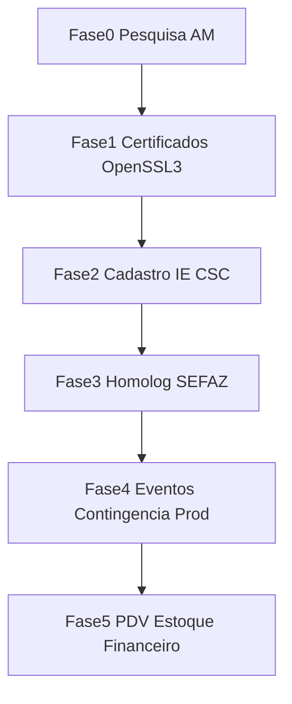
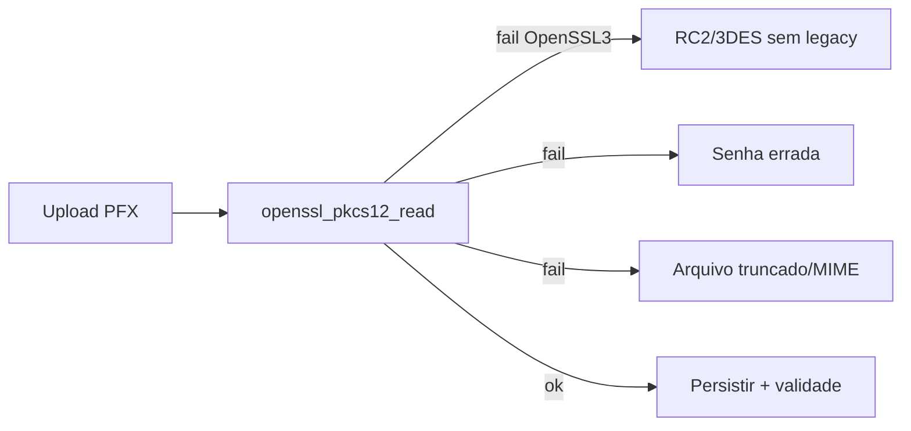

# Plano de Implementação: NFC-e Amazonas, Certificados A1 e PDV (repivot)

> **Data de elaboração:** 2026-07-19  
> **Escopo v1:** emissor NFC-e (modelo 65) produção-ready para o estado do Amazonas, correção do fluxo de certificados A1, e PDV/estoque/financeiro como fases posteriores.

## 1. Visão Geral

A G2M Fiscal deixa de ser apenas emissora de **NFS-e Nacional** e passa a também emitir **NFC-e** no Amazonas. Este plano prioriza:

1. Pesquisa documental SEFAZ-AM / Portal Nacional.
2. Correção do upload/leitura de certificados A1 (bug atual sob OpenSSL 3).
3. Integração SEFAZ-AM completa até produção (autorização, consulta, cancelamento, inutilização, contingência offline).
4. Só depois: PDV, estoque (Kardex) e financeiro básico.

### Baseline do código hoje

| Área | Situação |
|------|----------|
| NFS-e Nacional | Implementada (`NfseNacionalService`, job assíncrono) |
| NFC-e / NF-e (produto) | Core Engine nativo `App\Core\FiscalEngine\` (modelo 65, SOAP mTLS, CSC) |
| Biblioteca NFS-e | `nfephp-org/sped-common` (somente NFS-e; **proibido** `sped-nfe`/`sped-da`/ACBr/Focus para NFC-e) |
| Certificado A1 | `CertificadoA1Service` unificado (OpenSSL 3 + fallback legacy) |
| Ambientes locais | PHP 8.4 + OpenSSL 3.6.2 (Laravel Herd) |

Arquivos-chave atuais:

- [`app/Services/NfseNacionalService.php`](app/Services/NfseNacionalService.php) — emissão de serviço (não reutilizar para NFC-e).
- [`app/Core/FiscalEngine/`](app/Core/FiscalEngine/) — XML, XMLDSIG, QR/CSC, SOAP mTLS nativos.
- [`app/Services/Fiscal/RawNativeNfceIssuer.php`](app/Services/Fiscal/RawNativeNfceIssuer.php) — adapter Laravel do engine.
- [`app/Services/CertificadoA1Service.php`](app/Services/CertificadoA1Service.php) — leitura PFX A1.
- [`app/Http/Controllers/EmpresaController.php`](app/Http/Controllers/EmpresaController.php) — cadastro IE/CSC NFC-e + certificado.
- [`composer.json`](composer.json) — `sped-common` (NFS-e) + DomPDF; sem `sped-nfe`.

### Decisões técnicas fechadas

| Decisão | Valor |
|---------|--------|
| Documento fiscal v1 | NFC-e modelo **65** (não modelo 55) |
| UF | Amazonas (`cUF=13`), emissor com `UF=AM` |
| RTC / IBS-CBS (NT 2025.002+) | **Fora do v1**; backlog explícito se SEFAZ-AM passar a exigir |
| Stack NFC-e | **Nativa** (`DOMDocument`, OpenSSL, cURL) em `App\Core\FiscalEngine\` — sem `sped-nfe`, ACBr ou SaaS |
| Serviço / Adapter | `FiscalIssuerInterface` → `RawNativeNfceIssuer` (`FISCAL_NFCE_DRIVER=raw_native`) |
| Persistência | Tabela própria (`nfces`), distinta de `nota_fiscais` (serviço) |
| DANFE | DomPDF bobina 80mm (QR image via lib de desenho; URL/`cHash` nativos) |
| Senha do certificado | Continua funcional em plaintext no v1; criptografar com `Crypt` é melhoria pós-NFC-e |

---

## 2. Ordem de execução



**Nota:** a Fase 1 (certificados) pode e deve iniciar em paralelo ou antes do fechamento completo da Fase 0 — desbloqueia NFS-e e NFC-e.

---

## 3. Fase 0 — Pesquisa e consulta documental

**Objetivo:** checklist auditável de referências oficiais e decisões fechadas antes de escrever XML/SOAP.

### 3.1 Fontes oficiais (consultar e anotar data da consulta)

| Fonte | URL |
|-------|-----|
| Documentação técnica NFC-e AM | https://portalnfce.sefaz.am.gov.br/desenvolvedor/documentacao-tecnica/ |
| Ambiente de testes para desenvolvedores (software house) | https://portalnfce.sefaz.am.gov.br/desenvolvedor/ambiente-de-homologacao-para-desenvolvedores/ |
| Portal Nacional NF-e (MOC, Notas Técnicas) | https://www.nfe.fazenda.gov.br/portal/ |
| NT 2025.001 (QR Code v3 / CSC) | Portal Nacional — lista de Notas Técnicas |
| NT 2025.002+ (RTC / IBS-CBS) | Portal Nacional — **backlog v1**, não bloqueia | 

### 3.2 Checklist de pesquisa (obrigatório antes do código NFC-e)

- [ ] Confirmar no portal AM as URLs WSDL/SOAP vigentes (homolog contribuinte, homolog-nac, produção).
- [ ] Confirmar padrão de QR Code exigido pela SEFAZ-AM (v2 vs v3 / NT 2025.001).
- [ ] Confirmar se CSC + idToken seguem obrigatórios em homolog e produção.
- [ ] Registrar prazo de cancelamento e regras de contingência offline (tpEmis=9) para AM.
- [ ] Baixar/consultar XSD layout 4.00 vigente e regras de validação relevantes a venda interna AM.
- [ ] Verificar credenciamento NFC-e do contribuinte de teste (IE AM ativa).
- [ ] Decidir ambiente inicial de smoke: **homolog-nac** (CNPJ software house) → homolog contribuinte → produção.

### 3.3 Endpoints SEFAZ-AM (referência — revalidar na Fase 0)

#### Homologação do contribuinte (`nfce-services`)

| Serviço | URL |
|---------|-----|
| Autorização 4.00 | `https://homnfce.sefaz.am.gov.br/nfce-services/services/NfeAutorizacao` |
| Retorno autorização | `https://homnfce.sefaz.am.gov.br/nfce-services/services/NfeRetAutorizacao` |
| Consulta | `https://homnfce.sefaz.am.gov.br/nfce-services/services/NfeConsulta2` |
| Recepção evento | `https://homnfce.sefaz.am.gov.br/nfce-services/services/RecepcaoEvento` |
| Status serviço | `https://homnfce.sefaz.am.gov.br/nfce-services/services/NfeStatusServico2` |
| Inutilização | (confirmar no portal — espelhar produção `NfeInutilizacao2`) |
| QR Code consulta | `https://sistemas.sefaz.am.gov.br/nfceweb-hom/consultarNFCe.jsp?` |

#### Homologação nacional / software house (`nfce-services-nac`)

Não exige credenciamento prévio; usa CNPJ da software house.

| Serviço | URL |
|---------|-----|
| Autorização 4.00 | `https://homnfce.sefaz.am.gov.br/nfce-services-nac/services/NfeAutorizacao` |
| Retorno autorização | `https://homnfce.sefaz.am.gov.br/nfce-services-nac/services/NfeRetAutorizacao` |
| Consulta | `https://homnfce.sefaz.am.gov.br/nfce-services-nac/services/NfeConsulta2` |
| Evento | `https://homnfce.sefaz.am.gov.br/nfce-services-nac/services/RecepcaoEvento` |
| Status serviço | `https://homnfce.sefaz.am.gov.br/nfce-services-nac/services/NfeStatusServico2` |
| Inutilização | `https://homnfce.sefaz.am.gov.br/nfce-services-nac/services/NfeInutilizacao2` |

CSC de teste do ambiente nac: documentado no portal (ex.: token/id publicados pela SEFAZ — **não versionar segredos de produção**; CSC de homolog-nac pode constar em `.env.example` como placeholder).

#### Produção (`nfce-services`)

| Serviço | URL |
|---------|-----|
| Autorização 4.00 | `https://nfce.sefaz.am.gov.br/nfce-services/services/NfeAutorizacao` |
| Retorno autorização | `https://nfce.sefaz.am.gov.br/nfce-services/services/NfeRetAutorizacao` |
| Consulta | `https://nfce.sefaz.am.gov.br/nfce-services/services/NfeConsulta2` |
| Evento | `https://nfce.sefaz.am.gov.br/nfce-services/services/RecepcaoEvento` |
| Status serviço | `https://nfce.sefaz.am.gov.br/nfce-services/services/NfeStatusServico2` |
| Inutilização | `https://nfce.sefaz.am.gov.br/nfce-services/services/NfeInutilizacao2` |
| Administração CSC | `https://nfce.sefaz.am.gov.br/nfce-services/services/CscNFCe` |

### 3.4 Pré-requisitos do contribuinte

- Inscrição Estadual no Amazonas.
- Credenciamento como emissor NFC-e na SEFAZ-AM.
- CSC + idToken distintos para homologação e produção.
- Certificado digital A1 e-CNPJ válido.
- Série e faixa numérica de NFC-e definidas.

### 3.5 Escopo funcional fechado (v1)

- Emissão modelo 65, ambiente homolog e produção.
- `tpEmis` normal + contingência offline (`tpEmis=9`).
- Cancelamento (evento 110111).
- Inutilização de numeração.
- Consulta por chave/protocolo.
- DANFE NFC-e (impressão térmica).
- Formulário/API de “venda avulsa → NFC-e” (sem PDV completo).

### 3.6 Matriz de rejeições críticas (cobrir em testes)

| Cenário | Esperado |
|---------|----------|
| Status serviço indisponível | UX/job tratam sem travar; mensagem clara |
| CSC / idToken inválido | rejeição mapeada; não logar CSC completo |
| IE inexistente / divergente | rejeição cadastral |
| Série/número duplicado | prevenção via lock atômico + tratamento cStat |
| Schema XML inválido | falha antes do envio (validação local) |
| Certificado vencido | bloqueio no upload e na emissão |

### 3.7 Critério de saída da Fase 0

Seção “Decisões Fase 0” acima preenchida na prática (URLs revalidadas, CSC de homolog obtido, CRT/CFOP da empresa de teste definidos). **Nenhum XML/SOAP de NFC-e até o checklist mínimo (itens 1–5 da lista) estar ok.**

---

## 4. Fase 1 — Correção e robustez de certificados A1 (prioridade imediata)

**Objetivo:** destravar o upload de PFX válidos rejeitados hoje e unificar a leitura usada por NFS-e e NFC-e.

### 4.1 Hipótese principal do bug

Ambiente local: **OpenSSL 3.x**. Muitos A1 brasileiros ainda usam ciphers legados (RC2-40 / 3DES). `openssl_pkcs12_read` falha e a mensagem atual trata tudo como “senha incorreta ou arquivo corrompido”.



### 4.2 Tarefas de implementação

1. **Criar** `App\Services\CertificadoA1Service` como ponto único de leitura/validação PFX.
2. **Consumidores** devem migrar para o helper:
   - `CertificadoController::store`
   - `EmpresaController::processarCertificado`
   - `NfseNacionalService::carregarCertificado`
   - futuro `NfceAmService`
3. **Estratégia de leitura sob OpenSSL 3:**
   1. Tentar `NFePHP\Common\Certificate::readPfx` / `openssl_pkcs12_read` direto.
   2. Se falhar: converter via CLI `openssl pkcs12 -legacy` (ou provider legacy) para PFX moderno em temp; se a senha estiver correta, aceitar e **reescrever** o arquivo em `storage` em formato compatível.
   3. Mensagens distintas (não genéricas):
      - senha inválida;
      - algoritmo legado detectado / conversão necessária e falhou;
      - arquivo vazio ou não-PKCS12 (magic bytes + `openssl_error_string()`).
4. **Corrigir** `TestarCertificado`: trocar `caminho_arquivo` → `nome_arquivo`; reportar versão OpenSSL, erros OpenSSL e se o fallback legacy foi usado.
5. **UX** em [`resources/views/empresas/configuracao.blade.php`](resources/views/empresas/configuracao.blade.php): mensagens acionáveis (“verifique a senha”, “reexporte o PFX”, “certificado convertido de formato legado”).
6. **Segurança (pós-NFC-e, não bloqueante):** marcar criptografia de `certificados.senha` com `Crypt` como dívida técnica.

### 4.3 Critério de aceite

- PFX A1 válido que hoje é rejeitado passa no upload no Herd (OpenSSL 3).
- Mesmo certificado carrega em NFS-e e no futuro `NfceAmService`.
- `php artisan teste:certificado {empresa_id}` diagnostica corretamente.

---

## 5. Fase 2 — Cadastro fiscal do emissor NFC-e (AM)

**Objetivo:** dados mínimos do contribuinte para emitir, sem misturar com campos exclusivos de NFS-e.

### 5.1 Migration / campos novos em `empresas` (ou tabela auxiliar)

| Campo | Uso |
|-------|-----|
| `inscricao_estadual` | IE AM do emitente |
| `crt` | 1=Simples, 2=Simples excesso, 3=Regime normal |
| `nfce_serie` | Série da NFC-e |
| `nfce_ultimo_numero` | Último número autorizado/usado |
| `nfce_csc_id` / `nfce_csc_token` | Par CSC (preferir separar homolog/prod ou por `nfce_ambiente`) |
| `nfce_ambiente` | 1=produção, 2=homologação |
| `nfce_contingencia` / motivo / `nfce_contingencia_desde` | Flag operacional de contingência |

### 5.2 UI

Bloco **“NFC-e Amazonas”** na tela de configuração da empresa: IE, CRT, CSC/idToken, série, próximo número, ambiente (homolog/prod).

### 5.3 Regras

- MVP: apenas emissor `UF=AM` (`cUF=13`).
- CSC obrigatório para autorizar.
- Numeração: incremento atômico por `empresa_id` + série em transaction/lock (jobs concorrentes).

### 5.4 Critério de aceite

Empresa de teste salva IE/CSC/série/ambiente e validação impede emitir sem esses campos.

---

## 6. Fase 3 — Integração SEFAZ-AM (homologação)

**Objetivo:** primeira NFC-e autorizada em homologação, com XML + DANFE.

### 6.1 Dependências

**Proibido** instalar `sped-nfe`, `sped-da`, ACBr ou SDKs SaaS de emissão.

Opcional apenas para desenho do QR no PDF:

```bash
composer require endroid/qr-code
```

XML, XMLDSIG (RSA-SHA1 + C14N), CSC/`cHash`, SOAP e mTLS: PHP nativo (`DOMDocument`, OpenSSL, cURL).

### 6.2 Configuração

Criar `config/nfce.php` com URLs AM para:

- `homolog` (contribuinte)
- `homolog_nac` (software house)
- `producao`

Espelhar a tabela da Fase 0 após revalidação. Driver: `FISCAL_NFCE_DRIVER=raw_native`.

### 6.3 Core Engine, adapter e job

- `App\Core\FiscalEngine\*`: `A1Manager`, `NfceXmlBuilder`, `XmlDsigSigner`, `QrCodeGenerator`, `SefazSoapClient`.
- `App\Contracts\FiscalIssuerInterface` + `App\Services\Fiscal\RawNativeNfceIssuer`.
- `App\Jobs\EmitirNfceJob`: transport → `release()` backoff; rejeição SEFAZ → `rejeitado` sem requeue.
- Logs: apenas `cStat`, `xMotivo`, chave; **nunca** PFX, CSC completo ou XML com CPF em claro.

### 6.4 Persistência

Tabela `nfces` (nome definitivo na implementação), **separada** de `nota_fiscais`:

- `empresa_id`, chave, protocolo, número, série, ambiente, `tp_emis`, status, XML autorizado, motivo rejeição sanitizado, timestamps.

### 6.5 Comandos artisan

- `nfce:status-servico {empresa}` — health-check SEFAZ.
- `nfce:emitir-teste {empresa}` — smoke homolog (**homolog-nac** primeiro, depois homolog contribuinte).

### 6.6 Produto mínimo para emitir (sem PDV)

Cadastro enxuto de item + tela/API de venda avulsa:

- descrição, NCM, CFOP 5xxx interno AM, CST/CSOSN conforme CRT, unidade, valor unitário/quantidade.

### 6.7 Critério de aceite (homologação)

- Status serviço OK.
- Pelo menos 1 NFC-e autorizada.
- QR Code consultável no portal AM.
- XML armazenado + DANFE DomPDF (bobina 80mm).

---

## 7. Fase 4 — Produção-ready AM (eventos e contingência)

**Objetivo:** operação completa no Amazonas, não só “emitir uma vez”.

### 7.1 Funcionalidades

| Capacidade | Detalhe |
|------------|---------|
| Cancelamento | Evento 110111, dentro do prazo AM, motivo + vínculo à nota |
| Inutilização | Faixa série/número, registro auditável |
| Contingência offline | `tpEmis=9`: gerar/assinar/imprimir sem SEFAZ; fila de transmissão posterior; UX clara |
| Consulta | Por chave/protocolo; reimpressão DANFE |
| Go-live | CSC produção, credenciamento, smoke prod valor simbólico, monitor status, runbook de rejeições |

### 7.2 Checklist go-live produção

- [ ] CSC e idToken de **produção** configurados (não os de homolog).
- [ ] Credenciamento NFC-e do CNPJ ativo na SEFAZ-AM.
- [ ] Smoke test produção com valor simbólico autorizado.
- [ ] Cancelamento e inutilização testados em homolog; runbook operacional escrito.
- [ ] Contingência: emitir, imprimir, transmitir quando SEFAZ voltar.
- [ ] Alertas/monitoramento de `NfeStatusServico` (opcional: job periódico).

### 7.3 Critério de aceite (produção)

Fluxo completo: emitir → consultar → cancelar; inutilizar faixa; emitir em contingência e transmitir depois; documentação operacional atualizada neste plano (seção runbook).

---

## 8. Fase 5 (posterior) — PDV, estoque e financeiro

**Prioridade:** somente após Fases 0–4 estáveis em AM. Detalhamento propositalmente enxuto.

### 8.1 Backlog resumido

1. **Módulos por empresa** — tabela `empresa_modulos` (`pdv`, `financeiro`) + middlewares/policies.
2. **Produtos + Kardex** — `produtos` (NCM, CFOP, preços, EAN) e `estoque_movimentacoes` com auditoria; baixa em transaction na venda.
3. **PDV** — UI teclado-first (Alpine.js/Livewire), zero refresh, foco em código de barras; fechamento de venda dispara `EmitirNfceJob` de forma assíncrona (cliente liberado sem esperar SEFAZ).
4. **Financeiro básico** — `lancamentos_financeiros` (receber/pagar); venda à vista já nasce paga.

### 8.2 Diretrizes de performance e segurança (válidas para todas as fases)

- Eloquent `select()` rigoroso em listagens.
- Tenant: sempre `empresa_id` da sessão; `$request->validated()`.
- Log SEFAZ sanitizado (sem payload completo / PII).

---

## 9. Mapa de artefatos (implementação)

| Artefato | Fase |
|----------|------|
| `App\Services\CertificadoA1Service` | 1 |
| Migration campos NFC-e em `empresas` | 2 |
| `App\Core\FiscalEngine\*` | 3 |
| `App\Contracts\FiscalIssuerInterface` | 3 |
| `App\Services\Fiscal\RawNativeNfceIssuer` | 3 |
| `App\Jobs\EmitirNfceJob` | 3 |
| `config/nfce.php` | 3 |
| Migration / model `nfces` | 3 |
| DANFE DomPDF bobina 80mm | 3 |
| Comandos `nfce:status-servico`, `nfce:emitir-teste` | 3 |
| Cancelamento / inutilização / contingência | 4 |
| PDV / estoque / financeiro | 5 |

---

## 10. Fora de escopo (v1)

- NF-e modelo 55 (exceto se necessário para inutilização compartilhada de tooling — sem UI de NF-e).
- Outras UFs além do Amazonas.
- Certificado A3 / token.
- Campos da Reforma Tributária (IBS/CBS) na NFC-e.
- Homologação formal de software pela SEFAZ-AM (o estado não exige; auto-teste em homologação).
